# LaunchDarkly AutoFactory Demo

DarkCommerce, a minimal store (catalog, cart, checkout), used as the *target* for the
LaunchDarkly AutoFactory. Open a PR; a six-agent chain creates the flag, wires the code,
instruments metrics, writes tests, and records the rollout intent.

## What this is

A software factory turns a PR into a release-ready artifact: flagged, instrumented,
tested. The same agents make the same calls every run, so nothing depends on who reviewed
it.

- **Build**: factory runs at PR time, behind a flag, before anything ships
- **Deploy**: code goes out flag-off, no users affected
- **Release**: Beacon starts a guarded rollout, reverting if metrics degrade

## The pipeline, and who owns what

The pane draws one lane from request to released, and colours the rule along the top of
each card by who provides that stage. The distinction is the argument: the agents writing
code are the part any vendor can claim, so the chart's job is to show the parts around
them.

```mermaid
flowchart LR
  Request[Request] --> Agent[Coding agent] --> PR[Pull request] --> CI[CI run]
  CI --> Control[Agent control plane]
  Control --> Plan --> Flag --> Metrics --> Release --> Tests --> Gates[Evidence gates] --> Review
  Review --> Merge --> Deploy --> Beacon --> Guarded[Guarded release] --> Released
  Gates -. "a failed check halts the chain" .-> Flag
  Flag -. "judge scores tune the next run" .-> Control
  Review -. "rejected: back for revision" .-> Agent
  Guarded -. "regression: rolled back, then fixed here" .-> Agent
  classDef ld fill:#efecff,stroke:#5b4ae0,color:#241f1e
  classDef af fill:#f8effd,stroke:#a05ad6,color:#241f1e
  classDef ext fill:#f4f2f0,stroke:#b0a79f,color:#241f1e
  class Control,Guarded,Released ld
  class Plan,Flag,Metrics,Release,Tests,Gates,Review,Beacon af
  class Request,Agent,PR,CI,Merge,Deploy ext
```



Three colours, and the first two are neighbours on purpose:

- **LaunchDarkly platform** — the **agent control plane** (AI Configs supply every agent's
  instructions, model, tools and routing, editable without a deploy), the **judges** that
  score agent output, the flags and metrics as real resources, and the **guarded release**
  that ramps traffic, compares treatment against control, and reverts server-side.
- **AutoFactory** — the six agents, the deterministic **evidence gates** that re-derive
  each agent's claims from LaunchDarkly and the checkout, the release manifest, and Beacon.
  LaunchDarkly's code, running on the platform above it.
- **Your existing stack** — tracker, coding agent, GitHub, CI, test runner, CD. Neutral
  grey, and the honest answer to "what do we have to replace": nothing.

Concretely, per run: one multivariate flag (`control` + `v1`, off in every environment) as
the release gate, the metrics the revert decision reads, and `auto-factory-*` flags that
configure the factory itself.

Status stays the card fill — green done, blue running, grey waiting, red failed — so the
two questions ("where is it" and "whose is it") never compete for the same colour. Stages
after merge are drawn dashed and unfilled: the model is worth explaining, but nothing on
screen should claim to have run when it did not.

The four dashed return paths all exist today. The one a customer will ask for and not find
is a judge score sending work back to the coding agent: judges are sampled and
non-blocking, so a score never gates a run. Its real path is into AI Config monitoring,
where scores accumulate per variation and inform the instructions and model the *next* run
resolves. That loop improves the next change rather than fixing this one, and the chart
says so rather than overclaiming.

## Scenarios

| Branch | Change | Risk |
|--------|--------|------|
| `feature/express-checkout` | Buy Now, bypassing the cart | Medium |
| `feature/stripe-checkout` | Payments to Stripe (mocked) | Medium |
| `feature/tiered-pricing` | Quantity discounts in the cart | Medium |
| `feature/product-ratings` | Star ratings on product cards | Low |
| `feature/discount-codes` | Discount code at checkout | Medium |
| `feature/dynamic-pricing` | Demand-based price multiplier | High (~0.8) |

Each branch carries one commit: the feature, nothing else.

A commit to `main` leaves these branches behind it, and a branch that is behind has a diff
that *reverts* main's own commits. This is handled for you, in three places, so you should
never see "needs rebase":

- a **post-commit hook** rebases them the moment `main` moves (installed by `make hooks`)
- **`make menu`** syncs at startup, catching commits made elsewhere — a pull, or a merged PR
- **every path that opens a PR** checks the one branch it is about to use

The rebases run in a scratch worktree, so they never touch your working tree and work even
mid-edit. A branch that conflicts is left exactly as it was and reported rather than
half-rebased. `make sync` runs the same thing on demand, and `.autofactory/sync.log`
records what moved.

`.autofactory/services.yaml` marks pricing and checkout critical, so those score higher
blast radius; with `auto-factory-approval-mode` set to `risk-threshold`, `dynamic-pricing`
trips the approval gate.

## Setup

```bash
# first time, from anywhere; clones into the current directory
bash <(curl -fsSL https://raw.githubusercontent.com/gyeutter-launchdarkly/factory-ecom-example/main/demo/setup.sh)

# already cloned
bash demo/setup.sh

# --fresh answers every prompt with its default, for a zero-keystroke run
bash demo/setup.sh --fresh
```

Collects credentials, writes `.env.local`, provisions the seed flags, checks the AutoFactory
agent graph exists in your project (and offers to create it), installs the secret-blocking
git hook, configures the GitHub Action, starts the app, opens the demo menu.

Re-running it **resets first, without asking**: it deletes the factory's flags and metrics,
closes open PRs, rewinds the feature branches, and clears the run history. Saved
credentials come back masked so you can just press enter through them. `--fresh` keeps the
saved credentials and asks nothing at all; `--no-reset` keeps the current demo state.

You need:

- **LaunchDarkly**: an existing project. Your workspace must have Guarded Releases and
  AgentControl enabled.
  - bootstrapped with the AutoFactory agent graph, AI configs, and `auto-factory-*` flags
    ([how](https://github.com/launchdarkly-labs/launchdarkly-auto-factory/blob/main/INSTALL-CLAUDE-CODE.md)).
    Without them a run starts and exits with no output. `demo/setup.sh` checks for the
    graph and offers to provision it if it finds a factory checkout nearby; the demo never
    creates or destroys projects
  - [SDK key](https://app.launchdarkly.com/settings/sdk-keys)
  - [API token](https://app.launchdarkly.com/settings/authorization), Admin
- [**Anthropic API key**](https://console.anthropic.com/settings/keys)
- [**GitHub PAT**](https://github.com/settings/personal-access-tokens/new): Contents +
  Pull requests, *Read and write*
- **Docker** installed and running (via Docker Desktop or Colima)
- **[gh CLI](https://cli.github.com)** installed and logged in (`brew install gh && gh auth
  login`). The TUI uses your gh session to write the repo's Actions secrets and variables,
  which the PAT above is not permitted to do.
- Optional: **tmux + ttyd** (`brew install tmux ttyd`) to mirror the demo terminal into the
  app pane. Without them everything works as before, minus the Terminal tab.

One project holds everything, told apart by name: `auto-factory-*` flags are the factory's
config, `autofactory-*` AI configs are its agents, and flags it creates are named for the
feature and tagged `auto-factory`.

By hand instead: [docs/MANUAL-SETUP.md](docs/MANUAL-SETUP.md).

## When to rebuild

The app is a production `next build` baked into the image, so:

| Changed | Action |
|---------|--------|
| Anything under `src/`, `package.json`, `next.config.mjs`, `tailwind.config.ts`, `Dockerfile` | rebuild: `docker compose up -d --build` (~2 min) |
| Demo scripts, LD config, running a scenario, replays, `make reset` | nothing; the app is already serving |

The factory's progress reaches the pane through a bind mount on `.autofactory/`, so
runs and replays never need a restart. `make menu` → 2 works this out for you: it
rebuilds only when a build input is newer than the last build, and otherwise says so.

If the pane looks frozen during a demo, the usual cause is a browser tab left open
across a rebuild: the page's event stream dies with the old container. Reload the page
and it replays the current run from the start.

A hosted run reports a heartbeat every 30s, so the pane can tell "an agent is thinking"
from "the watcher is gone" — it only says `stalled` after five minutes of silence.

## Running it

```bash
make menu                               # one action per scenario (recommended)
make hosted SCENARIO=express-checkout   # same thing directly
```

`make hosted` is the whole demo in one command: it rebases the branch if it has fallen
behind main, opens or reuses the PR, starts the factory on GitHub Actions, streams
progress into the store's pane, and prints the conclusion.

GitHub is allowed to be down without ending the presentation. Transient API failures retry
first; if the outage persists, hosted mode switches to a clearly labelled **visual
simulation**. The terminal and menu show a red GitHub warning, the pane keeps moving through
the six steps with a red error note, and no PR, LaunchDarkly resources, links, or success
verdict are fabricated. If connectivity is lost after a real run starts, already-observed
steps remain real and only the remainder is marked simulated. Authentication and permission
errors do not use this fallback—they still stop so a broken setup cannot masquerade as an
outage.

Health is checked against both of GitHub's APIs, because they fail independently: PRs and
labels go through GraphQL, runs and repo variables through REST. A GraphQL-only outage was
what prompted this—REST answered normally throughout.

When a hosted run fails, the terminal prints why, not just that it did: a rejected API key,
an exhausted Anthropic balance, a deterministic check, or a real review verdict each get a
one-line cause and the fix. An expired key and a genuine agent failure look identical from
the pane otherwise, and the difference is a 30-second fix versus a talking point.

Only an **open** PR counts as the one to run against. A branch keeps the closed PRs from
earlier demos, so each run opens a fresh one rather than reusing a closed PR that can no
longer carry a check run.

The menu is presentation mode, and it is deliberately terse: one numbered line per step
and nothing else.

```
  1/5 pr      #9  https://github.com/you/repo/pull/9
  2/5 trigger 'autofactory' label added
  3/5 run     32076623420  https://github.com/you/repo/actions/runs/32076623420
  4/5 agents  pane http://localhost:3000 · ctrl-c stops watching, the run continues
  [########............]  33%  step 2/6 Flag
  5/5 result  success  https://github.com/you/repo/pull/9
```

A step that waits — a rebuild, GitHub picking the run up — rewrites its own line with the
elapsed time rather than printing a new one, and the bar names the agent by number so the
terminal and the flowchart can be read against each other. Problems still interrupt, as a
single red `!` line. Run `make hosted` directly when troubleshooting; direct commands keep
the complete output.

Nothing is lost by the terminal being quiet — every line still reaches the pane, which
shows it in a console beneath the steps with URLs clickable. That is the split: the
terminal says how far along the run is, the page says what happened.

The console reads the factory's wire format back in English, so it can be projected
without narrating jargon. Each step announces itself when it starts and reports what it
claimed when it ends, and the line under the scrollback names whatever is working right
now with its running time — an agent can think for minutes without printing anything, and
that line is the difference between "slow" and "stuck":

```
▸ step 2/6 Flag — started on anthropic sonnet-4-5
✓ step 2/6 Flag — finished — flag: checkout-express-lane
▸ step 3/6 Metrics — running 48s on anthropic sonnet-4-5
```

A rejection reads as a rejection: `✗ step 6/6 Review — rejected the diff — risk: high`.

### Private customer demo packs

Public `main` contains the framework and the generic DarkCommerce scenarios only. Create a
customer pack with:

```bash
make pack PACK=customer-id                 # private by default
make pack PACK=public-event VISIBILITY=public
```

Packs live under ignored `.autofactory/packs/<id>/`, with event payloads in `events/`,
captured real runs in `recordings/`, and local artwork in `assets/`. Press **p** in the TUI
or use the pack selector in the Factory pane; both write the same settings file.

A pack can also make the store *look* like the customer's. Add `storefront.json` next to
`pack.json` and the app renders that store instead of DarkCommerce: brand and logo, palette,
utility and category navigation, hero, callout, featured grid, categories, trust strip, and
the product catalog the rest of the demo sells. Image fields name a file in the pack's
`assets/` directory and are served from there, so customer artwork never enters `public/` or
the repository. Delete the file and the pack falls back to the built-in storefront.

```
.autofactory/packs/acme/
  pack.json           # id, name, visibility, repository
  storefront.json     # brand, theme, header, hero, categories, catalog
  assets/             # logo.png, hero.webp, product and category images
  events/             # <scenario>.json PR payloads
  recordings/         # captured real runs
```

The catalog is the live one: `/api/products` serves it, flags still sort and decorate it,
and the cart and checkout resolve against it, so a flag flip during the demo lands on the
customer's own parts rather than on headphones.

This stays data on purpose. A pack cannot load React into the public app, so anything beyond
words, colours, artwork, and catalog — a bespoke component, a new API route — belongs on a
local `customer/*` branch or in a private fork. Private packs fail closed in hosted mode
unless GitHub confirms that the current repository is private. This matters because deleting
customer files in a later commit does not remove them from public Git history, and a PR in a
public repository is public by definition.

The installed pre-push hook applies the same rule to `customer/*` branches and
`customer-seed/*` tags, so `git push --all` cannot accidentally publish a local customer
demo to the public origin.

`pack.json` records `id`, display `name`, `visibility`, optional `repository`, and
`scenarios`. Scenario discovery itself comes from `events/*.json`, so the TUI and browser
cannot drift apart. Keep the event's `pull_request.head.ref` pointed at the corresponding
branch in that fork.

### The terminal in the page

With tmux and ttyd installed, `make menu` runs itself inside a tmux session and serves that
session on `127.0.0.1:7681`, which the pane shows in a **Terminal** tab under the steps. It
is the actual session, not a copy: whatever you do in your window, the audience sees on the
screen, so you can present from one browser window instead of switching to a terminal.

Loopback only. Input from the page is forwarded, because the useful things there are mouse
events: the wheel scrolls back through tmux's history and a drag copies to the clipboard. A
read-only tmux client discards mouse events along with keys, so a locked mirror cannot be
scrolled or selected from at all — set `FACTORY_TTY_READONLY=1` if you would rather have a
pane nobody can touch. The browser never controls the window *size* either way: it attaches
with tmux's `ignore-size`, so a viewer reporting an odd geometry cannot squash the presenter's
terminal.

| Variable | Default | Effect |
|----------|---------|--------|
| `FACTORY_TTY` | `1` | `0` disables the whole thing |
| `FACTORY_TTY_PORT` | `7681` | Port ttyd serves on |
| `FACTORY_TTY_READONLY` | `0` | `1` locks the page out (no scrolling or selecting) |

Selecting text with the mouse copies it straight to the system clipboard. It all runs on a
private tmux socket (`tmux -L autofactory`), so none of this touches a personal tmux config.
`ctrl-b d` detaches without stopping the demo; quitting the menu takes the web terminal down
with it. The **Console** tab is always there as the fallback.

Four execution modes are switchable in the TUI and browser:

| Mode | PR | What runs | Use |
|------|----|-----------|-----|
| Live PR | new or attach | real agents on GitHub Actions | full-fidelity demo |
| Local agents | none | real graph through `phase1-cli` in a disposable clone | skip PR and queue overhead |
| Recorded run | none | accelerated capture of a previous real run | deterministic short talk track |
| Rehearsal | none | synthetic six-step stream | practice and outage fallback |

Local mode still spends time on the six model calls, but removes GitHub PR, queue, and log
polling. It always uses the sandboxed Anthropic runner and leaves the generated diff under
`.autofactory/local-runs/`. For the lowest perceived wait with full hosted fidelity, start
the workflow before the meeting and choose **Attach to active run**.

A rejection explains itself in every mode. Hosted runs get the reviewer's verdict comment on
the PR, which the pane links from the failed Review step. Local runs have no PR, so the
runner prints the deciding agent's own rationale, the pane raises its first line as an error
note, and the unedited output is kept at `.autofactory/local-runs/<run>/factory-run.log`.

After any completed run, `demo/capture-recording.sh <scenario>` stores its event stream in
the active pack. The browser disables Recorded mode until that scenario has a capture; it
never silently substitutes a synthetic run.

The act runners are disabled. Under act the factory action exits in ~185ms without
running any agents while act still reports success, so it silently produces nothing.
`make ci` and `make pr` now refuse with an explanation rather than appear to work; set
`FACTORY_ALLOW_ACT=1` to retest after an upstream fix. The evidence is in
`demo/ci/run.sh`: the same remote bundle run by hand in act's own runner image, with
act's node 24, produces 47 lines and runs the chain.

**Merging triggers nothing.** Phase 1 is the PR-time half. Post-merge is Beacon, and a
*deploy* starts it, not the merge: `auto-factory-notify` POSTs the deployed SHA range to
`/flag-releases`, which finds the new `.release-flags/` manifests and begins the rollout.
So merge, deploy, notify, release.

### Driving the demo from the page

The expanded pane has a **demo** row: choose a pack, execution mode, hosted PR behavior and
scenario, then start it. *Rehearse*, *Reset demo* (one confirmation, because it force-pushes
branches), and *Clear history* remain one-click fallbacks. These are the same settings and
actions as the menu, so a demo can be run end to end from one browser window. The picker
follows whichever run is on screen, so re-running the one you are looking at is a single
click.

**Guided run** is the presentation path. It enlarges the pane and automatically moves
through four acts: customer problem, factory at work, independent verdict, and proof of
value. A cue strip supplies one sentence to say and one detail to point at for the active
agent. The finale holds the verdict briefly, then summarizes flags, metrics, tests, release
handoff, links, and total time. A normal run remains available when presenter cues would be
distracting.

Scenario event files can provide customer-specific framing without putting it in the
framework:

```json
{
  "demo": {
    "problem": "Why the customer needs this change",
    "goal": "What safe delivery must prove",
    "payoff": "The business outcome to close on"
  }
}
```

Private packs keep these words in their ignored or private `events/*.json` files. If the
fields are absent, the guide falls back to the PR body and generic release language.

*Rehearse* is the deterministic path: the synthetic replay, same six steps, always
approved, about twelve seconds, and nothing created. It is the only way to guarantee a
green run in front of an audience — and it proves nothing, because no agent ran. *Run
factory* is the real chain, and a real chain can reject.

The app is a container with no repo, no `gh` and no LaunchDarkly key, so it cannot run any
of that itself. The buttons post an action to `/api/factory-control`, which leaves a
request file in `.autofactory/control/` — the one writable corner of an otherwise
read-only mount — and `demo/lib/control-watch.sh` on the host carries it out and writes
the result back. The browser never supplies a command: the action has to match the fixed
allowlist and the scenario has to exist in the active pack, so a stray request cannot
become arbitrary shell.

The watcher lives and dies with `make menu`, and the pane greys the buttons out unless its
heartbeat is fresh — a page left open after the demo says the controls need the menu
rather than queueing work nobody will run. Output goes to
`.autofactory/control/watcher.log`, since a run started from the page has no terminal of
its own; progress still streams into the flowchart and the **Console** tab. Set
`FACTORY_CONTROL=0` to leave the watcher off.

## Resetting

From the pane: **Reset demo**. From a terminal:

```bash
make reset          # or: bash demo/setup.sh --reset
```

Deletes flags and metrics tagged `auto-factory` (keeping the seed flags and the factory's own
config), closes open `feature/*` PRs, rewinds branches to their `demo-seed/*` tags. Closing
the PRs matters: one left open gets rewritten by the force-push and can re-run the
factory, so its results show up in your next demo. `make reset-ld` does LD only.

## Demo talk track

Fits a 10-minute slot. The trick is to **start the run first** and narrate over it,
rather than talk and then wait.

Store and LD side by side. `dynamic-pricing` is the fastest scenario (11 lines changed);
`express-checkout` is the most visual (a whole new page).

**0:00 Start it**

1. `make menu` → 1 → pick a scenario. One action: it opens the PR, starts the factory on
   Actions, and streams progress into the store's bottom pane.

**0:30 While it runs, set the scene**

2. LD → filter tag `auto-factory`, showing only the seed flags and the factory's own config
3. LD → `show-product-reviews` on
4. Store → refresh, review counts appear
   > "The flags a human wrote. The factory copies this pattern."
5. Store → walk the flow the scenario changes
6. Bottom pane → narrate as the rail fills: Plan · Flag · Metrics · Release · Tests ·
   Review. Flag, Metrics and Review carry the talk; Release is the Beacon handoff and
   Tests are credibility. Each box names the model and what it produced, and the console
   underneath carries the same narration the terminal shows, with the PR, flag and metric
   links clickable.
7. Use the colours once, early: the agents are AutoFactory, the control plane and guarded
   release are the LaunchDarkly platform, and everything grey is what they already run.
   The judge pills and the `✓ n checks` pills are the answer to "how do you know the agent
   was right"; the dashed tail after Merge is what happens next, not what happened here.

**~6:00 The payoff, once the chain finishes**

7. Pane → click the flag link → LD
8. LD → the metrics, wired to the `checkout-completed` event the app already tracks
9. LD → toggle the new flag on
10. Store → refresh, the feature appears. Don't rush this one
    > "The agent created that flag, wired it, gave it metrics. No deploy, no code change."

**~9:00 Optional closer**

11. LD → AI configs → show a model swap. The whole chain was retuned to Haiku from here,
    no redeploy. That is why it takes ~6 minutes instead of ~15.

**After** `make menu` → 5 to reset.

### Measured timings

| | |
|---|---|
| Chain on Sonnet | 13.4 min |
| Chain on Haiku | 6.7 min |
| Setup (checkout, deps) | ~0.5 min |

Per-agent on Sonnet: flag-testing 3.1, flag-implementer 2.7, metrics-author 2.5,
research-planner 2.3, manifest-steward 1.6, code-reviewer 1.2.

### Rehearsing

```bash
make demo-progress                                # synthetic run, no Anthropic call
./demo/replay-progress.sh express-checkout 2 7 &   # two at once, shows the PR dropdown
./demo/replay-progress.sh stripe-checkout  3 9 &
```

## Further talking points

- **Judges**: LD → AI configs → flag-implementer / metrics-author tabs. Scores 0–1 with
  reasoning, against the agent's actual git diff.
- **Guarded releases**: the `.release-flags/` manifest declares the flag key and rollout
  parameters; Beacon picks it up on deploy and auto-reverts on metric degradation.
- **Feature management**: flip `auto-factory-approval-mode` from `yolo` to
  `risk-threshold` live, then run `dynamic-pricing`. The chain pauses at the gate and
  comments which label to add. Approval is a flag change, not a deploy.
